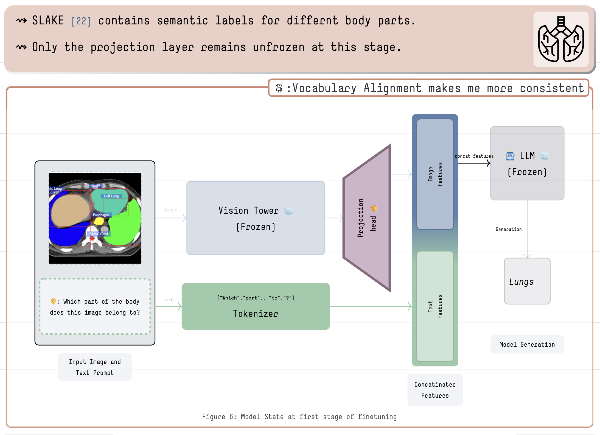
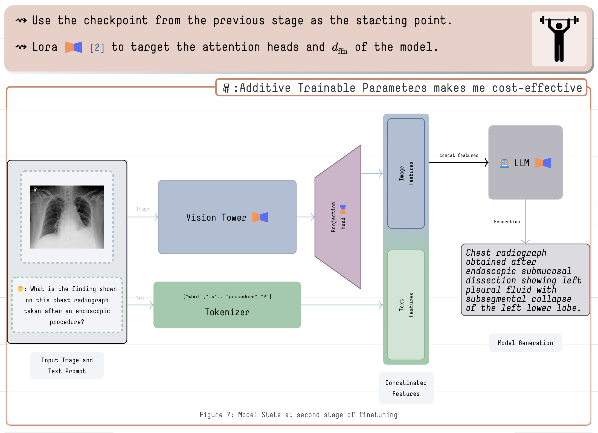

[](https://git.io/typing-svg)

# Data Explorer (Sample)
Please Find the prompts to generate QA Pairs in the submitted article.
we present a sample here


## Code Navigation

### First Stage FineTuning



```py
...
model = PaliGemmaForConditionalGeneration.from_pretrained(
    model_id,
    device_map="auto",
    quantization_config=quantization_config,
)

# Freeze all parameters besides the projection layer
for param in model.parameters():
    param.requires_grad = False

for name, param in model.named_parameters():
    if name.startswith("multi_modal_projector.linear"):
        param.requires_grad = True
```


### Second Stage FineTuning

Find the code for performing First stage finetuning here : 

```py
def bar():
    pass
```


# Diagnostic Tool 
You can find our submodule at:
https://anonymous.4open.science/r/lvlm-interpret-4A27
