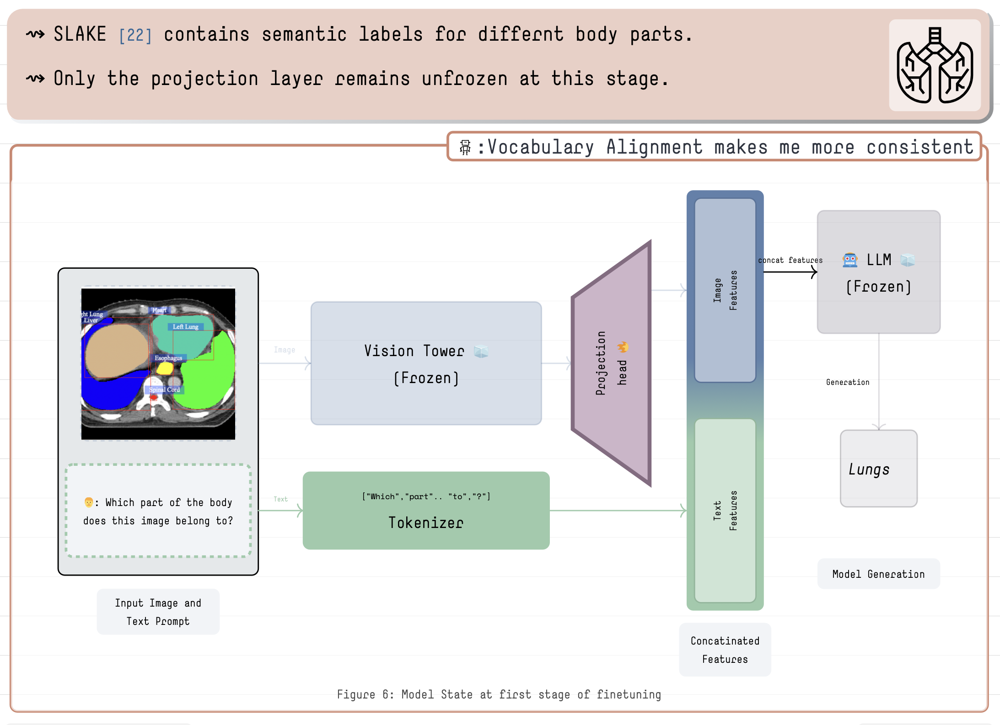
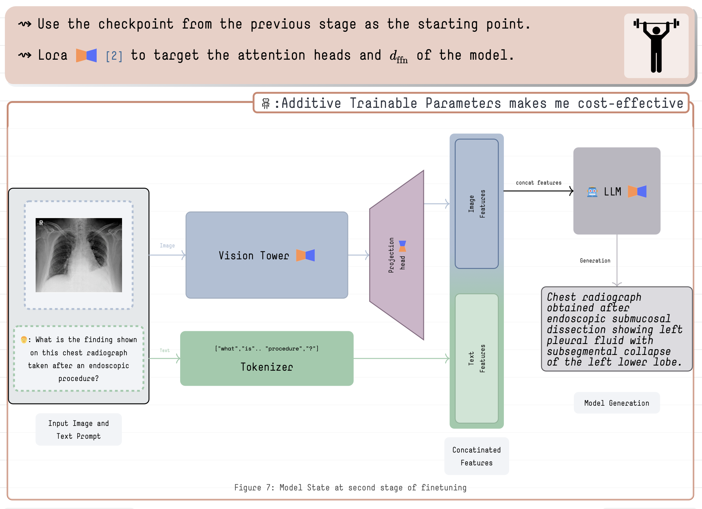

    <a href="https://github.com/adishourya/medm_article/blob/main/research_internship2024.pdf" target="_blank">
    

---
## Data Availablity
You can find the dataset generation prompts in their README.

| Dataset            | Link |
|--------------------|------|
| ROCO V2 Train     | [ROCO-QA-Train](https://huggingface.co/datasets/adishourya/ROCO-QA-Train) |
| ROCO V2 Test/Valid | [ROCO-QA](https://huggingface.co/datasets/adishourya/ROCO-QA) |
| Medpix Unfiltered | [MEDPIX-ClinQA](https://huggingface.co/datasets/adishourya/MEDPIX-ClinQA) |

---
## Code Navigation

### First Stage FineTuning

Find the code for performing First stage finetuning here : 

### Second Stage FineTuning

Find the code for performing First stage finetuning here : 
